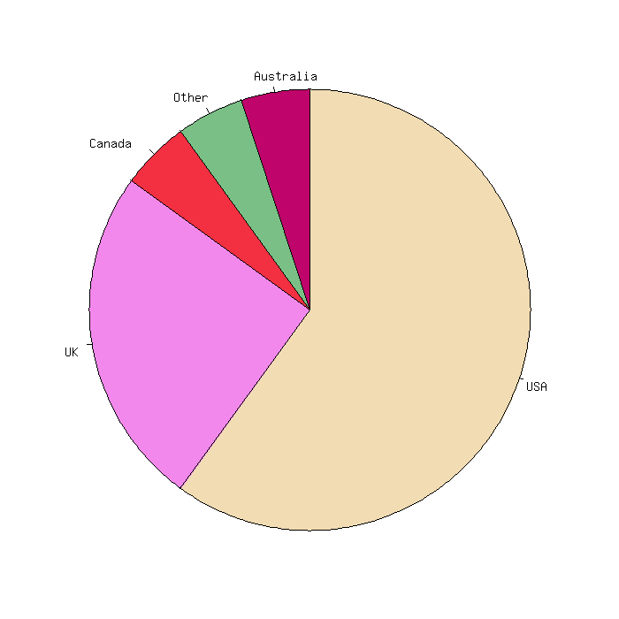

# Requirements
- cmake_minimum_required(VERSION 3.5)
- gcc 9.4.0 or newer
- libgd-dev 2.2.5 or newer
- math

# Compilation
The code can be compiled with the CMakeLists.txt file provided with cmake_minimum_required(VERSION 3.5).

# Sample Execution & Output
If run without command line arguments, using

```
./pie -h
```
the following help message will be displayed.

```
This program, written in C language, plots a pie chart and saves it to a .png file. The program is 
based on the gd library and has many options. The percentages and the filename are mandatory 
parameters. 
The program is used via the command line interface. 

Options: 
-b: background color in RGB of the image. For example, in order to have a black background, 
type "-b 0-0-0".
-c: size in pixels of the chart. For example, to have an pie chart of 200 pixels across by 200 pixels 
tall, type "-i 200."
-e: color in RGB for the edges and the labels. For example, in order to have a white color, 
type "-e 255-255-255".
-f: output filename.
-h: help to explain how to use the program.
-i: size in pixels of the image. For example, to have an output image of 500 pixels across by 
500 pixels tall, type "-i 500-500."
-l: labels for the chart. For a pie chart of three slices, the labels are given as follows 
"-l africa-asia-europe".
-p: percentages of the slices. For a pie chart of three slices, the percentages are given as follows 
"-p 20-30-50".
-s: color in RGB of the slices. For a pie chart of three slices, the colors are given as follows 
"-s 255-255-205/150-10-150/175-7-72."
```


The pie chart above has been produced with the following command run in the folder where the executable 
"pie" file is.

```
./pie -b 255-255-255 -e 0-0-0 -f camembert -i 700-700 -l USA-UK-Canada-Other-Australia -p 60-25-5-5-5 
-s 242-220-179/242-136-235/242-48-65/122-191-133/191-4-107 -c 500
```
# Documentation
The code's documentation is accessible via the file "doxygen documentation html/index.html".
